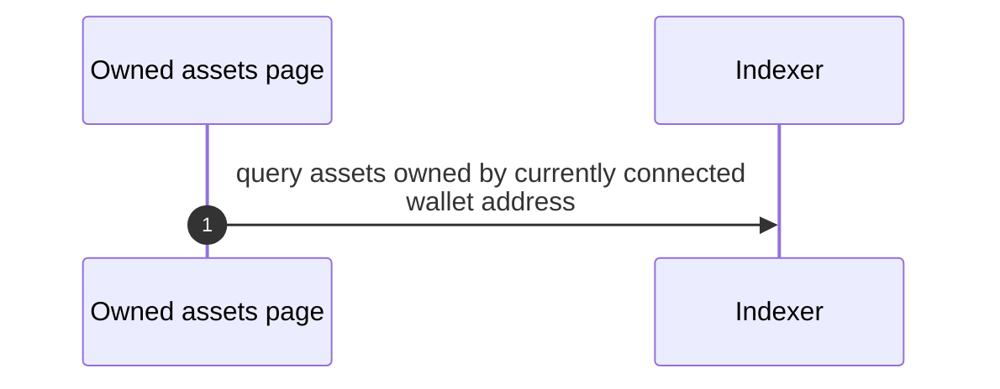
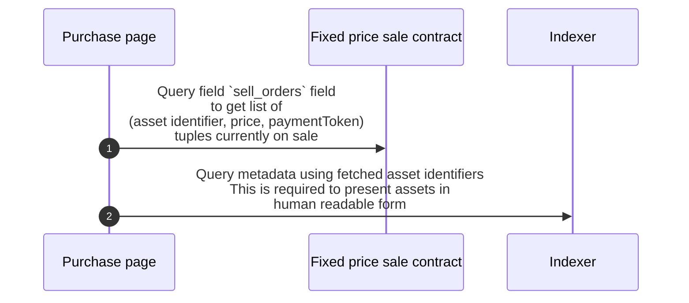

# Owned assets fetch

```mermaid
sequenceDiagram
    autonumber

    participant Owned assets page
    participant Indexer

    Owned assets page->>Indexer: query assets owned by currently connected <br> wallet address
```

# Assets sale data fetch

```mermaid
sequenceDiagram
    autonumber

    participant Purchase page
    participant Fixed price sale contract
    participant Indexer

    Purchase page->>Fixed price sale contract: Query field `sell_orders` field<br>to get list of<br>(asset identifier, price, paymentToken)<br>tuples currently on sale
    Purchase page->>Indexer: Query metadata using fetched asset identifiers <br> This is required to present assets in <br> human readable form
```

